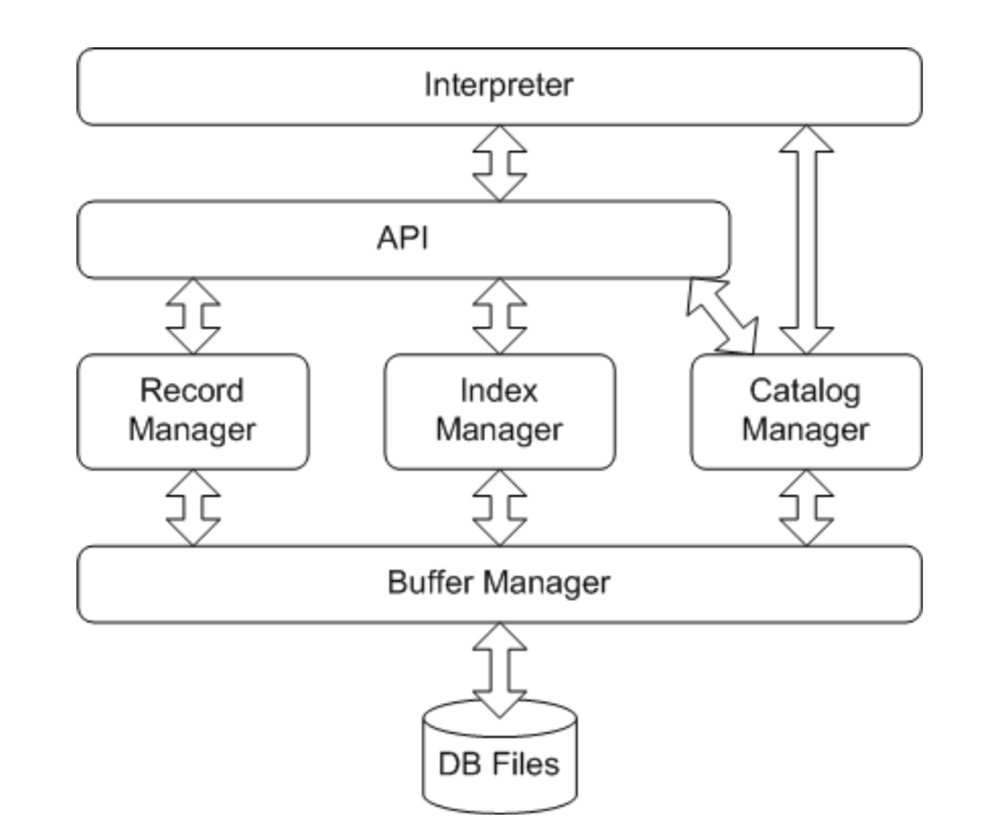

# MiniSQL

## Structure and Dependency

项目架构基于项目指导，但有所改动。



### 代码依赖

```
package common:
    //存储公共的数据结构、方法

package main: 
    Main -->(依赖) Interpreter

package interpreter:
    DefaultInterpreter -->(实现接口) main.Interpreter
    DefaultInterpreter -->(依赖) DatabaseFacade

package middlelayer:
    DefaultDatabaseFacade -->(实现接口) interpreter.DatabaseFacade
    DefaultDatabaseFacade -->(依赖) CatalogManager
    DefaultDatabaseFacade -->(依赖) IndexManager
    DefaultDatabaseFacade -->(依赖) RecordManager

package manager:
    package manager.catalog:
        DefaultCatalogManager -->(实现接口) middlelayer.CatalogManager
        DefaultCatalogManager -->(依赖) FileHandler

    package manager.index:
        DefaultIndexManager -->(实现接口) middlelayer.IndexManager
        DefaultIndexManager -->(依赖) FileHandler

    package manager.reocrd:
        DefaultRecordManager -->(实现接口) middlelayer.RecordManager
        DefaultRecordManager -->(依赖) FileHandler

package file:
    package file.buffer:
        DefaultBufferManager -->(实现接口) FileHandler
        DefaultBufferManager -->(依赖) DiskFileManager

    package file.diskfile:
        DefaultDiskFileManager -->(实现接口) DiskFileManager
```


