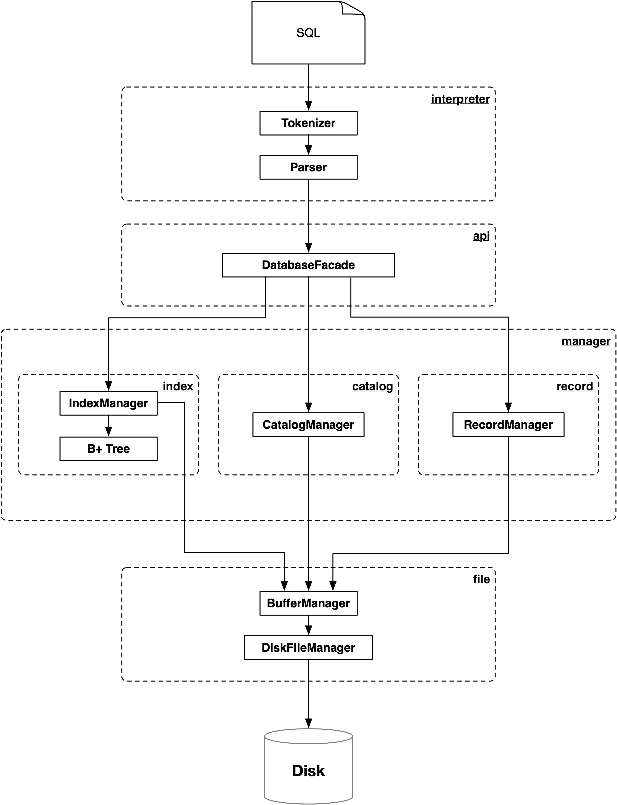

# MiniSQL

MiniSQL 是一个简单的数据库系统，允许用户通过命令行交互持久化数据。

## 实现功能

#### 创建表语句

```
create table 表名 ( 列名 类型 ,
	列名 类型 ,
	列名 类型 ,
	primary key ( 列名 ) 
);
```

#### 删除表语句

```
drop table 表名 ;
```

#### 创建索引语句

```
create index 索引名 on 表名 ( 列名 );
```

#### 删除索引语句

```
drop index 索引名 ;
```

#### 选择语句

```
select * from 表名 [where 条件] ;
```

其中 `条件` 的格式为：

```
列 op 值 and 列 op 值 ... and 列 op 值
```

`op` 是算术比较符：

```
= <> < > <= >=
```

#### 插入记录语句

```
insert into 表名 values ( 值1 , 值2 , ... , 值n );
```

#### 删除记录语句

```
delete from 表名 [where 条件] ;
```

#### 退出系统语句

```
quit;
```

#### 执行 SQL 脚本语句

```
execfile 文件名 ;
```

## 架构设计

MiniSQL 基本的架构如下：



本架构充分考虑到模块化与解耦合。模块之间使用"依赖反转"方法进行编写。

### Interpreter

对于 interpreter 部分来说，它所知道只是 `DatabaseFacade` 提供的一个接口，而对具体实现一无所知。该部分主要功能是解析通过命令行或脚本传入的 SQL 语句，并将其转变为内部数据结构。

Interpreter提供的接口如下：

```java
public interface Interpreter {
    void interpret();
}
```

### DatabaseFacade

解释器和具体内部引擎之间通过 Facade 设计模式进行联系，`DatabaseFacade` 充当一个对外的门面，提供若干 API 给解释器部分。其主要接口为：

```java
public interface DatabaseFacade {
    List<Info> createTable(String tableName, List<Column> columns, Column primaryColumn);
    List<Info> deleteTable(String tableName);
    List<Info> createIndex(String indexName, String tableName, String columnName);
    List<Info> deleteIndex(String indexName);
    List<Info> select(String tableName, List<Condition> conditions);
    List<Info> insertTuple(String tableName, List<Object> values);
    List<Info> deleteTuple(String tableName, List<Condition> conditions);
    List<Info> quit();
}
```

### CatalogManager

`CatalogManager` 主要提供有关表的信息的创建与删除，也包含初始化和退出时的一些必要操作，其主要接口如下：

```java
public interface CatalogManager {
    List<Info> createTable(String tableName, List<Column> columns, Column primaryColumn);
    List<Info> deleteTable(String tableName);
    List<Info> quit();
    void init();
}
```

### IndexManager

`IndexManager` 主要提供有关索引的支持，内部实现的数据结构为 B+树，提供创建索引、删除索引、查找、删除、插入等接口方法：

```java
public interface IndexManager {
    void updateIndexes(Tuple tuple, Table table, int offset);
    List<Integer> getOffsets(List<Restriction> restrictions, Table table);
    void deleteOffsets(List<Tuple> tuples, Table table);
    List<Info> createIndex(String indexName, String tableName, String columnName);
    List<Info> deleteIndex(String indexName);
    boolean violatePrimaryKey(Table table, Tuple tuple);
}
```

### RecordManager

`RecordManager` 主要提供关于具体 tuple 的操作，比如插入、删除、查找，并直接与文件接口的 record 部分交互，其主要接口为：

```java
public interface RecordManager {
    List<Info> insertTuple(String tableName, List<Object> values);
    List<Info> deleteTuple(String tableName, List<Restriction> restrictions);
    List<Info> selectTuple(String tableName, List<Restriction> restrictions);
    Tuple bytesToTuple(String tableName, List<Type> types, int base);
}
```

### File

所有有关文件的操作被包含在 `file` 包中，上层模块（RecordManager，IndexManager和CatalogManager）不必在乎是否有缓存的存在，只要知道这个模块会帮助持久化数据即可。这样一来就可以实现逻辑的解耦合。

这个模块包含 buffer 和硬盘操作的支持，其主要 API 为：

```java
public interface FileHandler {
    List<Info> quit();
    void writeTableCatalogToFile(Table table);
    void writeTupleToFile(byte[] bytes, String tableName, int offset);
    Collection<Table> readAllTableCatalogsFromFiles();
    ByteCarrier readTupleBytes(String tableName, int offset, int length);
    void createTable(String tableName);
    void init();
    List<Info> deleteTable(String tableName);
}
```

## 数据结构

### B+ Tree

索引的部分使用 B+ 树实现，B+树作为整体提供如下接口：

```java
public interface BPlusTree {
    Node getRoot();
    List<Integer> find(Object key);
    List<Integer> find(Range range, List<Object> notEqualValues);
    void insert(Object key, int index);
    void delete(Object key);
    void delete(Range range, List<Object> notEqualValues);
    void print();
    boolean exist(Object key);
    int getDepth();
}
```

B+ 树的节点分为两类，一类是 `NonLeafNode` ，还有一类是 `LeafNode` ， 它们都实现了 `Node` 接口：

```java
public interface Node {
    void printSubTree(String prefix, boolean isTail);
    boolean isRoot();
    Node getParent();
    boolean isLeaf();
    Node split();
    Object getSmallestKey();
    void setParent(Node root);
    int keysCount();
    void setKeys(List<Object> keys);
    Node getPreviousSibling();
    Node getFollowSibling();
    int getRank();
    void merge(Node sibling);
    void deleteKeyAndCorrespondingPointer(Object key);
    Object getKey(int i);
    int childrenCount();
    void borrowChildrenFrom(Node node);
    void setKey(int i, Object key);
    String printKeys();
}
```

每个节点除了都含有指向孩子节点的引用外，还有指向父节点的引用。而对于 `LeafNode` 来说，每个叶节点还含有指向兄弟节点的引用。`NonLeafNode` 和 `LeafNode` 的数据结构整体如下：

```java
class NonLeafNode implements Node {
    private List<Node> children = new ArrayList<>();
    private List<Object> keys = new ArrayList<>();
    private Node parent;
}

class LeafNode implements Node {
    private List<List<Integer>> records = new ArrayList<>();
    private List<Object> keys = new ArrayList<>();
    private Node parent;
    private LeafNode previousLeaf;
    private LeafNode nextLeaf;
}
```

### Hash Index

在通过 `tableName` 索引表 `Table` 以及通过 `indexName` 索引 `Index` 时，本系统使用了哈希索引，使用 Java 标准库提供的 `HashMap` 来简单实现。

### 其他数据结构

#### Table

```java
class DefaultTable implements Table {
    private String tableName;
    private List<Column> columns;
    private Column primaryKey;
    private int tuplesCount = 0;
    private List<Type> types;

    // columnName -> index
    private Map<String, Index> indexesMap = new HashMap<>();

    //index name -> index
    private Map<String, Index> indexesNameMap = new HashMap<>();
    
    private Queue<Integer> freeTuplePositions = new LinkedList<>();
    private int tupleSize;
    private int lastTuplePosition;
}
```

`Table` 中主要存储了一些 metadata 以及与表格相连的索引。这里使用两个 `HashMap` 来方便通过索引名或列名来快速查找索引。同时，一个空余位置列表被维护起来，用于支持 lazy deletion。

#### 类型系统

本系统共有三种数据类型，分别为 `IntType` 、`FloatType` 、`CharNType` 。它们都实现了 `Type` 接口：

```java
public interface Type {
    boolean checkType(Object object) ;
    int getSize();
}
```


## 关键实现

本部分主要说明关键的实现或优化部分。

#### SQL 语句解析

在解析 SQL 语句时使用了 Java 上流行的编译器前端库 ANTLR（相当于C/C++ 上的 Flex/Bison）。每条 SQL 语句被解析后生成一棵 parse tree，对这棵 parse tree 进行遍历的过程中同时解释执行它，将它翻译成引擎内部的数据结构。

#### 带 `where` 的 SQL 语句

对于带 `where` 的 SQL 语句，系统先按照不同列的条件，将所有条件分成组。接着系统对于每一组查看是否有索引，如果有索引那么使用索引找出对应 tuple 的序号，将所有有索引的约束全部使用后对结果取交集。如果还有没有索引的条件，那么在剩下的结果中线性查找得到结果。

#### Buffer

本系统的缓存使用操作系统的虚拟内存映射技术，使用 Java 的 `MappedByteBuffer` 将磁盘文件映射为虚拟内存，从而实现缓存的效果。之所以这么做是因为对于使用了虚拟内存映射的文件，JVM 不会使用 JVM 内存进行分配而是直接使用操作系统内存进行分配，这样有效避免了 JVM 内存不足的情况。并且，由于使用了虚拟内存映射，避免了大量的系统调用，所以可以大幅度提高速度。

#### Lazy Deletion

在删除一条记录时，使用 lazy deletion 方法，在表格的 metadata 中记录下这条被删除记录的位置（标记为 free），下次插入时优先插入这个位置。

#### 硬盘文件格式

##### Record

每个表的数据放在不同的文件中（即一个表格对应一个文件），由于本系统不支持变长域，所以所有条目的长度时固定的。因此可以将每条记录的长度计算出来，依次写入文件。文件格式为：

```
//record file
(field1 field2 field3 ...)*
```

##### Catalog 与 Index

由于本系统中每个索引只涉及到一个表格，所以将索引与表格合并存储。

每个表格专门有一个文件存储 metadata，其中存储了表格的记录总数、表格数据文件的 free list，表格的名称、表格的列的名称与类型等信息，具体如下：

```
//format of table metadata
tableName: String
columnCount: int
(column: Column)+
primaryKeyIndex: int
tuplesCount: int
typesCount: int
(type: Type)*
indexCount: int
(indexName: String, columnName: String, index: Index)*
freeTuplePositionsCount: int
(position: int)*
lastTuplePosition: int
other operation:
generateTypesBuffer(): generate types, tupleSize
```

## 分工

Interpreter 和 api：

RecordManager：

CatalogManager：

IndexManager：陈佳伟

BufferManager 和 DiskFileManager：

## 环境与依赖

* Java 11
* Gradle：工程依赖管理
* ANTLR 4.7.2：辅助解析 SQL 语句
* Guava 27.1：提供一些 Java 标准库没有的常用函数
* Lombok 1.18.8：提供一些 Java 没有的方便的语言特性


